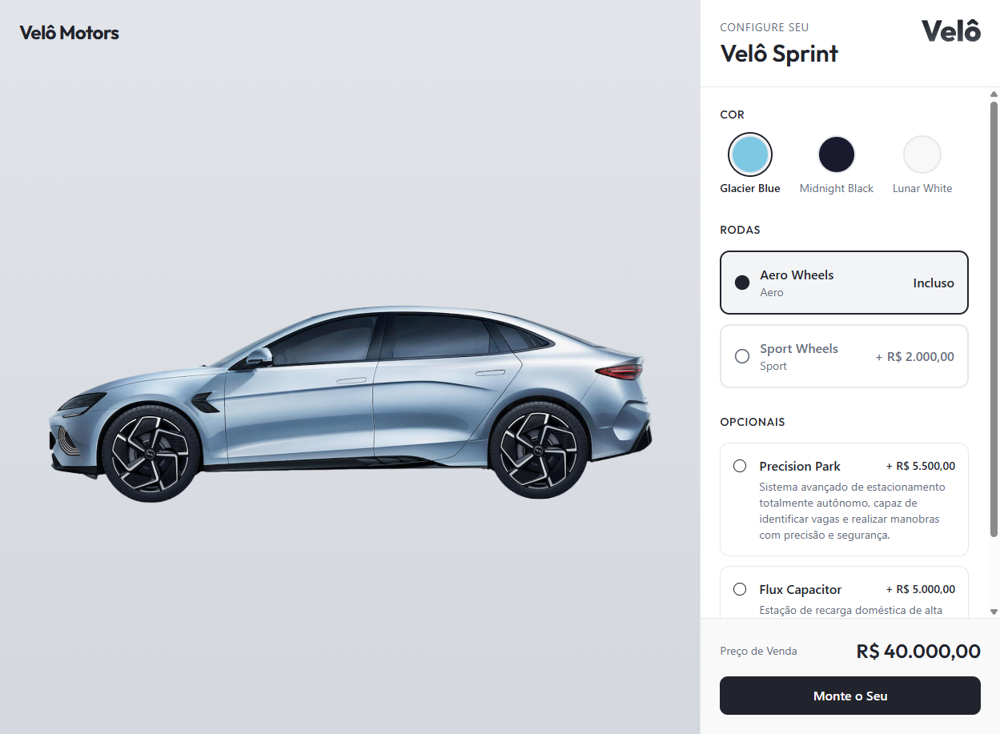
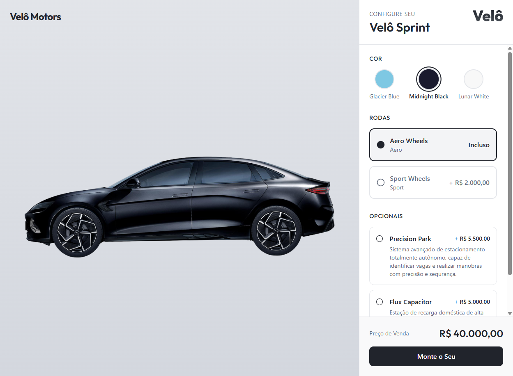
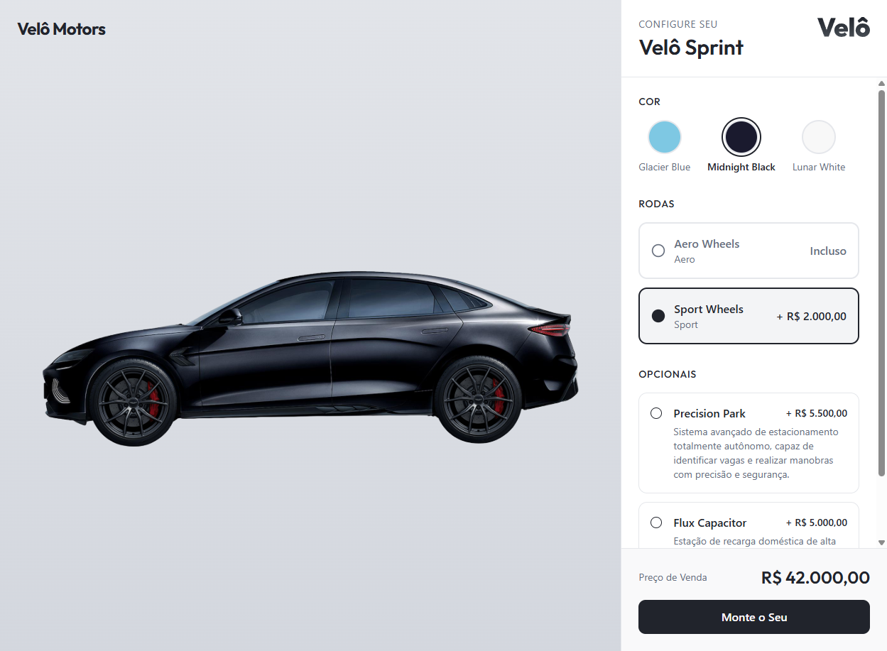
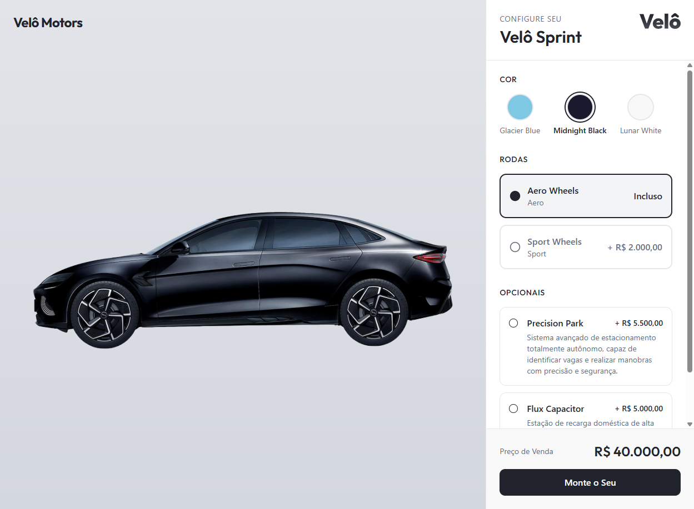

# Relatório de Execução - CT02

## CT02 - Configuração do Veículo (Cores e Rodas) e Cálculo do Preço Base

| Item | Detalhe |
|------|---------|
| **Caso de Teste** | CT02 - Configuração do Veículo (Cores e Rodas) e Cálculo do Preço Base |
| **Ambiente** | http://localhost:5173 |
| **Ferramenta** | Playwright MCP |
| **Data/Hora** | 17/06/2026 15:50 (UTC-4) |
| **Navegador** | Chromium (Playwright) |
| **Resultado Geral** | ✅ **APROVADO** |

---

## Objetivo

Validar se as escolhas de cores e rodas ("Sport") refletem corretamente no preço final exibido no Configurador.

## Pré-Condições

- Estar na página do Configurador (`/configure`). ✅
- Preço base inicial deve ser de R$ 40.000,00 (Cor padrão "Glacier Blue" + Rodas "Aero"). ✅

---

## Resultado dos Passos

| Id | Ação | Resultado Esperado | Resultado Obtido | Status |
|----|------|--------------------|------------------|--------|
| 1 | Verificar o preço inicial de venda | Preço de venda deve ser R$ 40.000,00 | Preço exibido: **R$ 40.000,00** (Glacier Blue + Aero Wheels) | ✅ Aprovado |
| 2 | Selecionar cor exterior diferente ("Midnight Black") | Cor do preview alterada, preço permanece R$ 40.000,00 | Preview alterado para "midnight-black"; preço manteve **R$ 40.000,00** | ✅ Aprovado |
| 3 | Selecionar a roda "Sport Wheels" | Roda do preview alterada, preço total +R$ 2.000,00 (Total R$ 42.000,00) | Preview "sport wheels"; preço atualizado para **R$ 42.000,00** | ✅ Aprovado |
| 4 | Selecionar novamente a roda "Aero Wheels" | Preço total decrementado em R$ 2.000,00, voltando a R$ 40.000,00 | Preview "aero wheels"; preço retornou para **R$ 40.000,00** | ✅ Aprovado |

---

## Verificação dos Critérios de Aceitação

- ✅ Rodas "Sport" custam exatamente +R$ 2.000,00 (R$ 40.000,00 → R$ 42.000,00).
- ✅ Trocar apenas a cor do exterior não altera o preço base (permaneceu R$ 40.000,00 ao mudar para Midnight Black).
- ✅ O preço dinâmico é atualizado instantaneamente apenas ao alterar a roda para "Sport".

---

## Evidências

### Passo 1 - Preço inicial (R$ 40.000,00)

### Passo 2 - Cor "Midnight Black" (preço inalterado R$ 40.000,00)

### Passo 3 - Roda "Sport Wheels" (R$ 42.000,00)

### Passo 4 - Volta para "Aero Wheels" (R$ 40.000,00)

---

## Observações

- Nenhum erro de console foi registrado durante a execução (0 errors; apenas 2 warnings não relacionados ao fluxo).
- O preço foi atualizado instantaneamente após cada interação, sem necessidade de recarregar a página.
- Conclusão: o CT02 foi executado com sucesso e **todos os passos e critérios de aceitação foram atendidos**.
